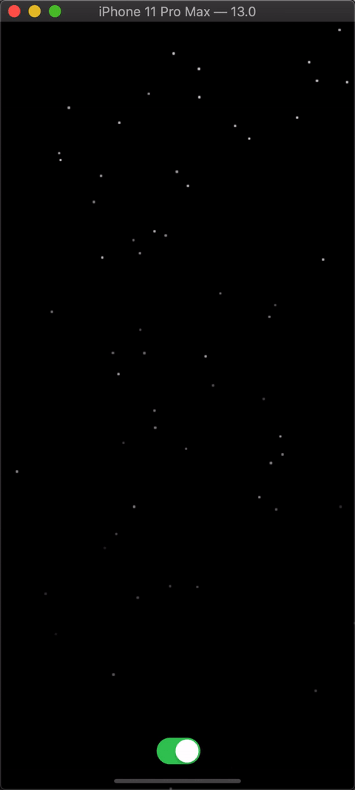

# SnowEffectViewBuilder

<!--[](https://travis-ci.org/DADA/SnowEffectViewBuilder)
[](https://cocoapods.org/pods/SnowEffectViewBuilder)
[](https://cocoapods.org/pods/SnowEffectViewBuilder)
[](https://cocoapods.org/pods/SnowEffectViewBuilder) -->

This repository provides a `SnowEffectViewBuilder` to display snow effect.

It can create a `UIView` by calling:

```swift
func createView(type: SnowType, size: CGSize) -> CAEmitterLayer
```

or create a `CALayer` by calling:

```swift
func createLayer(type: SnowType, size: CGSize) -> CAEmitterLayer
```

and it provides three ways to setup the snow particle.

- Use Emoji with font size
- Draw circle with size and color
- Use custom `UIImage`

```swift
public enum SnowEffectViewBuilder.SnowType {
	case emoji(string: String, fontSize: CGFloat)
	case circle(size: CGSize, color: UIColor)
	case customImage(image: UIImage)
}
```



Merry Christmas ☃️☃️☃️☃️☃️☃️.


## Example

To run the example project, clone the repo, and run `pod install` from the Example directory first.

## Installation

SnowEffectViewBuilder is available through [CocoaPods](https://cocoapods.org). To install
it, simply add the following line to your Podfile:

```ruby
pod 'SnowEffectViewBuilder'
```

## Author

DADA, nalydadad@gmail.com

## License

SnowEffectViewBuilder is available under the MIT license. See the LICENSE file for more info.
